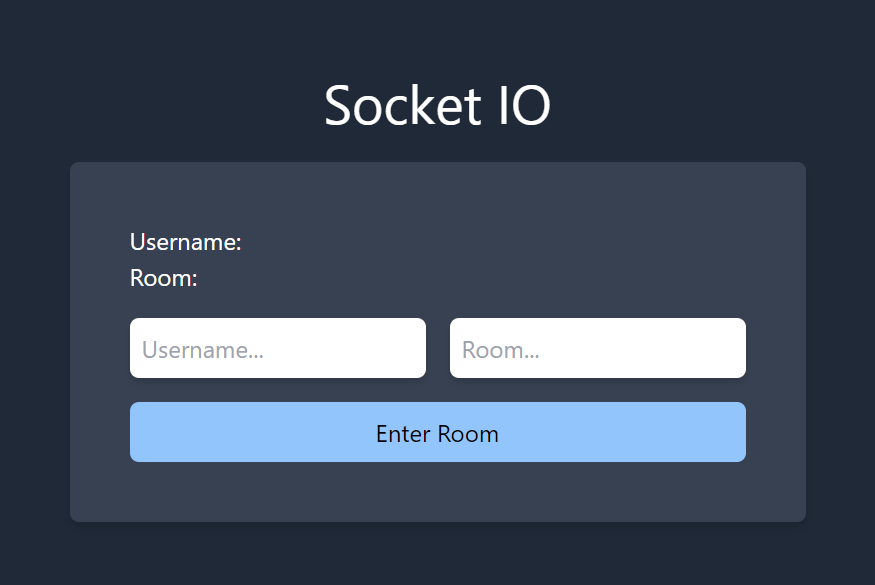
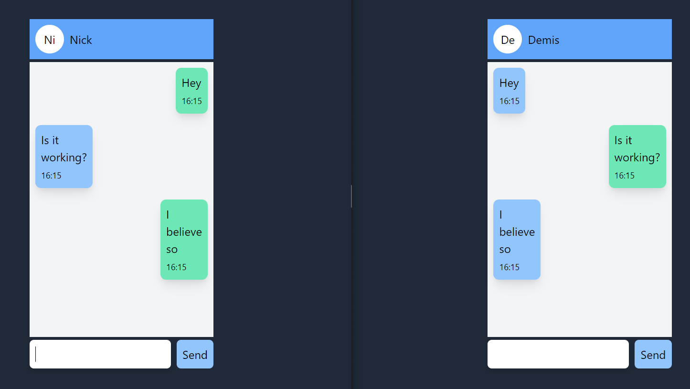

## socket.io - Vue 3

Tutorial: [Chat using socket.io](https://www.youtube.com/watch?v=NU-HfZY3ATQ 'Youtube video')

### Setup project

`yarn` to install dependencies

`yarn serve` to start project

### Username and Room

### Chat

#### Todo

- [ ] Auto Scroll to bottom.
- [ ] Better UI.
- [ ] Clear message after send it with button.
